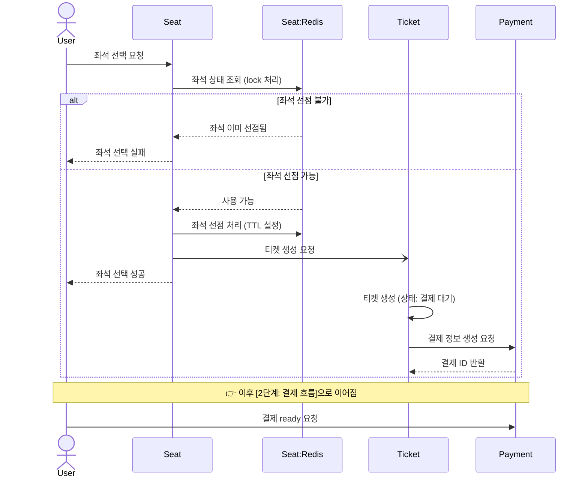
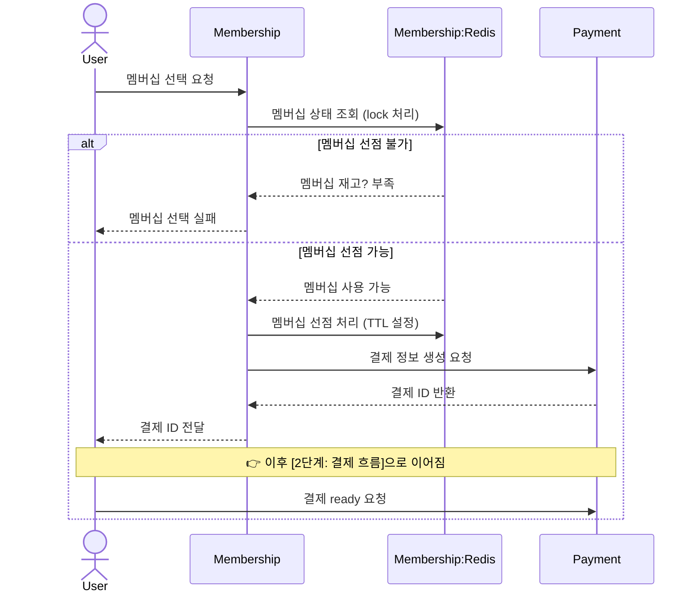
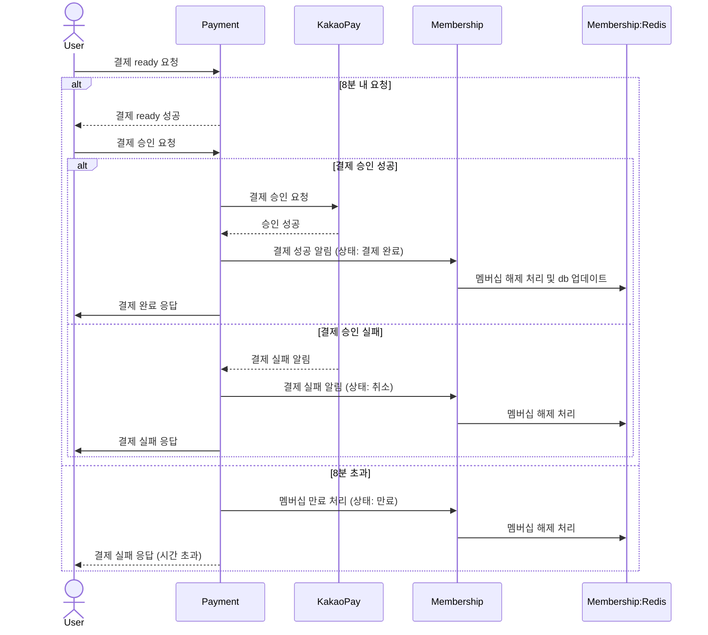
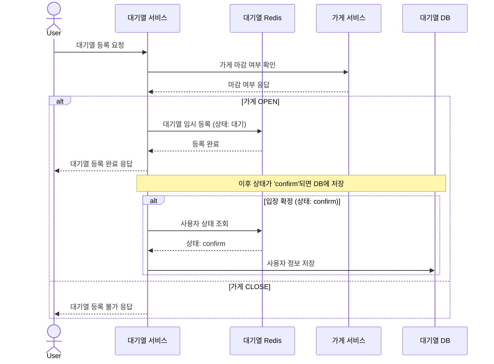

# OingLogistics


홈런티켓은 KBO 리그 티켓팅 서비스를 제공하는 통합 플랫폼으로, 기존 분산되어 있던 야구 구단별 티켓팅을 통합해보고자 기획되었습니다. </br>
특장점으로는 시니어 전용 좌석을 확보해 선예매 서비스를 제공함으로써 디지털 취약 계층도 경기를 관람할 수 있도록 하였습니다. 또한, 굿즈샵 원격 줄서기 서비스를 통해 현장 대기로 인한 경기장 혼잡도를 낮출 수 있을 것으로 기대합니다.</br>
대용량 트래픽이 예상되는만큼, MSA(Micro Services Architecture)를 도입하고 도메인 주도 설계(DDD)를 적용해 분산 환경에서의 운영을 고려하였습니다. 실제 운영 환경에서의 효율적인 장애 대응을 위해 logback, prometheus로 로그와 시스템 메트릭을 수집하고, GCP Cloud Logging, Grafana를 연동하여 모니터링할 수 있도록 구성하였습니다.</br>
1차 MVP 개발 기간 이후, 코드리뷰를 바탕으로 전략 패턴 등의 다양한 디자인 패턴을 도입함으로써 코드의 유지보수성을 고려한 코드 리팩토링을 진행하였습니다. 이후, 2차 리팩토링 기간에 JMeter를 활용한 주요 API 부하 테스트를 진행하며 DB 인덱싱 등을 통해 성능을 최적화하고 시스템 자원 사용량 지표를 개선하였습니다.</br>

## :walking: 프로젝트 소개

### 서비스 목표
- **대규모 트래픽 대응**
    - 인기 경기 예매 시 순간 트래픽 폭주를 견디기 위해 `Redis` 기반의 좌석 선점 시스템과 비동기 메시징 처리 구조를 설계 및 적용
    - 좌석, 주문, 결제 등 주요 기능을 독립적인 MSA 아키텍처로 분리하여 트래픽 분산 및 서비스별 확장성을 확보
    - `JMeter`를 활용해 500개 이상의 스레드 환경에서 부하 테스트를 진행하고, 초당 200건 이상의 처리량을 목표로 성능을 최적화
    - 응답 지연 최소화를 위해 API 및 DB 접근 경로를 효율화하고 병목 구간 지속적으로 점검 및 튜닝
- **MSA 환경에서의 데이터 일관성 및 트랜잭션 관리**
    - MSA 환경에서 데이터 일관성 및 트랜잭션 관리를 위해 서비스 간 분산 트랜잭션을 지양하고, 
    이벤트 기반 최종 일관성(Eventual Consistency) 패턴을 적용하여 안정적인 데이터 처리를 구현
    - `Kafka`, `Redis` 기반의 이벤트 및 메시징 시스템을 도입하여 서비스 간 비동기 데이터 동기화 및 장애 발생 시 신속한 복구 체계를 마련
- **확장 가능하고 유연한 구조**
    - 도메인별 마이크로서비스 아키텍처를 기반으로 설계하여, 새로운 기능이나 비즈니스 요구사항에 대한 빠른 대응과 유연한 확장이 가능
- **서비스 모니터링 시스템 구축**
    - `Prometheus` + `Grafana` 기반 실시간 메트릭 수집 및 대시보드 모니터링 환경 구축
    - 이상 현상에 대한 이메일 및 Slack 알림 설정
    - 예매 성공률, 응답 속도, 대기열 처리량 등 주요 성능 지표에 대한 알림 설정 및 장애 대응 프로세스 정립

### 기술적 목표
- **서비스 간 유연한 통신 전략 구현**
    - 요청-응답 기반 통신은 FeignClient, 비동기 이벤트 기반 처리는 Kafka를 활용하여 상황에 따라 최적의 방식으로 서비스 간 통신을 구성하였습니다.
- **역할 기반 권한 처리 및 접근 제어**
    - 인증(Authentication)은 API Gateway에서 처리하고, 인가(Authorization)는 각 마이크로서비스 내부에서 처리하도록 분리 설계하였습니다.
    - 사용자 요청 시 Http Header와 Redis에 저장된 로그인 정보를 비교하여 권한 유효성을 검증합니다.
    - Spring MVC의 Interceptor의 preHandle() 단계를 활용해 Controller 진입 전 권한 확인을 수행합니다.
    - API별로 사용자 역할이 상이할 경우, Service 레이어에서 **추가적인 역할 검증**을 수행하여 보안성을 강화하였습니다.
- **캐싱 및 성능 최적화**
    - 사용자 로그인 정보 및 인증 관련 데이터는 Redis에 캐싱하여 분산 환경에서도 안정적인 세션 관리와 빠른 인증 처리를 가능하게 하였습니다.
    - **조회 빈도가 높은 정적 데이터(예: 업체 정보, 허브 목록 등)** 는 Caffeine Cache를 이용한 로컬 캐싱으로 처리하여 응답 속도와 처리 성능을 크게 향상시켰습니다.
    - 두 캐시 전략을 역할 및 데이터 특성에 따라 분리 적용함으로써, 서비스의 응답성, 확장성, 효율성을 모두 고려한 최적의 캐싱 구조를 구성하였습니다.
- **DB 성능 최적화**
    - QueryDSL을 활용한 동적 쿼리를 통해 복잡한 조건 검색에서도 안정적인 성능을 유지하였습니다.
    - 동일 Aggregate에 속한 엔티티 간 조인 시, N+1 문제를 방지하기 위해 FETCH JOIN 전략을 활용하였습니다.
- **코드 재사용성과 유지보수성 향상**
    - 여러 명의 백엔드 개발자가 협업할 때, **공통 유틸리티 및 서비스 계층을 적극 활용**하여 중복 코드 최소화에 초점을 두었습니니다.
    - SOLID 원칙과 DRY(Don’t Repeat Yourself) 원칙을 기반으로 객체지향적인 설계를 지향하였습니다.
    - 각 기능은 **단일 책임 원칙(Single Responsibility Principle)** 에 따라 모듈화하여 유지보수성을 높였습니다.
    - **공통 코드에 대한 라이브러리를 MVN Repository에 배포**하여 일관성 있는 코드베이스를 유지하였습니다.


## :memo: 개발 노션 및 산출물

[프로젝트 설계 및 구현 산출물](https://github.com/BoeingMerryHo/kbo-ticketing-platform/wiki)

## :construction_worker: 팀원 역할 분담

| 팀원명 | 포지션 | 담당 |
|--------|--------|------|
| **이지언** | 👑 Leader | **▶ Ticket Service**<br>- 티켓 생성/관리 로직 구현<br>- Kafka 기반의 티켓 생성<br>- FeignClient 호출 오류 시 Resilience4J로 Retry 적용. 최종 실패 시 fallback 메서드로 DLQ 전송<br><br>**▶ Maven Repository**<br>- 마이크로서비스의 공통 모듈 구성<br>- Maven Central Repository 배포<br>- 버전 관리로 오류 수정/기능 추가<br><br>**▶ Infra**<br>- GCP 환경에서 docker-compose로 배포<br>- Prometheus + Grafana 모니터링 시스템 구축<br>- GCP Logging으로 로그 중앙화<br>- GCP Monitoring 알림 연동 |
| **김기훈** | 🫅 Member | **▶ User Service**<br>- 회원가입/로그인 API 구현<br>- BCrypt 기반 비밀번호 암호화<br>- Observer 패턴 적용으로 후속 처리 분리<br><br>**▶ Gateway**<br>- 필터 기반 API 요청 검증<br>- JWT 인증, Redis 블랙리스트 전략 도입<br>- MDC 기반 요청 단위 로그 트레이싱<br><br>**▶ Queue Service**<br>- Redis ZSet 기반 인메모리 데이터 처리<br>- Redisson 분산 락으로 race condition 방지<br>- Testcontainers 기반 단위 테스트 환경 구성 |
| **이예본** | 🫅 Member | **▶ Store Service**<br>- Redis ZSet Delay Queue 기반 줄서기 예약<br>- ZRANGEBYSCORE를 활용한 Polling 성능 최적화<br>- 커스텀 메트릭 수집<br><br>**▶ Membership Service**<br>- Redis Lua Script로 동시성 제어<br>- 시즌 종료 시 멤버십 자동 만료 로직<br>- 선점 요청 관련 커스텀 메트릭 수집 |
| **이하은** | 🫅 Member | **▶ Payment Service**<br>- 카카오페이 API 연동<br>- logback 기반 시스템 로그 및 지표 수집<br><br>**▶ JMeter tester**<br>- 부하 테스트 시나리오 구성<br>- 정규식 기반 데이터 추출<br>- CSV Data Set Config로 동적 요청 구성 |
| **전은배** | 🫅 Member | **▶ Seat Service**<br>- Redisson으로 분산 락 구현<br>- Scheduler로 자동 좌석 생성 및 정리<br>- 멤버십별 선예매 기능 구현<br>- Redisson Batch로 통신 최적화<br>- RFuture로 비동기 좌석 조회<br>- RSet으로 블록 내 좌석 정보 저장<br><br>**▶ Table Index**<br>- Match<br>- User<br>- Ticket<br>- Payment |


## :calendar: 개발 기간

2025.04.03 - 2025.05.01 (4주)

MVP 개발 (04.03 ~ 04.17 - 2주)

- 기획 및 핵심 기능 개발

1차 리팩토링 (04.18 ~ 04.24 - 1주)

- 디자인 패턴 및 클린코드 기반 객체지향 리팩토링 및 설계 개선

2차 리팩토링 (04.25 ~ 05.01 - 1주)

- 시스템/애플리케이션 메트릭 연동 및 모니터링 설계, 부하 테스트 및 성능 최적화

## :hammer_and_wrench: 사용 기술

### 🛠 버전

| 분류 | 상세 |
| --- | --- |
| **IDE** | IntelliJ IDEA |
| **Language** | Java 17 |
| **Framework** | Spring Boot 3.4.4 |
| **Build Tool** | Gradle 8.1 |
| **Database** | MySQL 8.4 |
| **In-Memory DB** | Redis |
| **Local Cache** | Caffeine |
| **Message Queue** | Kafka |
| **API 통신** | REST API, FeignClient |
| **컨테이너화** | Docker |
| **배포** | GCP |


### 🛠 주요 기술 스택

| 분류               | 상세                                      |
|--------------------|-------------------------------------------|
| **Backend**            |                               |
| **Database**       |                                    |
| **Version & Issue**      |                          |
| **Infra**     |                               |


## :building_construction: 시스템 아키텍처


## :memo: ERD


## :memo: Monitoring


## :movie_camera: 기능
### :memo: 티켓 예매 Flow
- 좌석 선점 및 티켓 생성 시퀀스 다이어그램

</br>


  ```mermaid
sequenceDiagram
  actor User as User
  participant Seat as Seat
  participant Redis as Seat:Redis
  participant Ticket as Ticket
  participant Payment as Payment

  User ->> Seat: 좌석 선택 요청
  Seat ->> Redis: 좌석 상태 조회 (lock 처리)
  alt 좌석 선점 불가
    Redis -->> Seat: 좌석 이미 선점됨
    Seat -->> User: 좌석 선택 실패
  else 좌석 선점 가능
    Redis -->> Seat: 사용 가능
    Seat ->> Redis: 좌석 선점 처리 (TTL 설정)
    Seat -) Ticket: 티켓 생성 요청
    Seat -->> User: 좌석 선택 성공
    Ticket ->> Ticket: 티켓 생성 (상태: 결제 대기)
    Ticket ->> Payment: 결제 정보 생성 요청
    Payment -->> Ticket: 결제 ID 반환
  end
  Note over User, Payment: 👉 이후 [2단계: 결제 흐름]으로 이어짐
  User ->> Payment: 결제 ready 요청
```

</br>

- 티켓 결제 시퀀스 다이어그램

</br>



</br>

### :memo: 맴버십 구매 Flow
- 멤버십 선점



</br>

- 멤버십 결제

</br>



</br>

### :memo: 원격 줄서기 Flow

</br>



### :desktop_computer: 프로젝트 주요 기능

<details>
<summary>사용자 (user-service)</summary>

### User (사용자 관리)

- **UserAdminController (/admin/v1/users)**
    
    ### 서비스 개요
    
    UserAdminController는 관리자용 사용자 관리 API를 제공 및 사용자 등록, 조회, 수정, 삭제, 권한 관리, 이메일 인증, 로그인/로그아웃, 토큰 갱신 기능 제공.
    
    ### 주요 기능
    
    1. **사용자 등록 (POST /register) :** 사용자 정보(아이디, 비밀번호, 이메일 등)를 입력받아 관리자 회원 가입
    2. **사용자 조회**
        - **단일 사용자 조회 (GET /{id})**: ID로 특정 사용자 정보를 조회
        - **사용자 검색 (GET /search)**: 페이지네이션과 정렬 조건을 포함해 사용자 목록을 검색
    3. **사용자 정보 수정**
        - **관리자 정보 수정 (PUT /{id})**: 특정 사용자의 정보를 갱신
        - **본인 정보 수정 (PUT /me)**: 로그인한 관리자가 자신의 정보를 수정
        - **사용자 권한 수정 (PUT /roles/{id})**: 특정 사용자의 권한을 변경
    4. **사용자 삭제**
        - **본인 탈퇴 (DELETE /me)**: 로그인한 관리자 회원 탈퇴
        - **사용자 삭제 (DELETE /{id})**: 특정 사용자를 삭제
        - **사용자 권한 삭제 (DELETE /roles/{id})**: 특정 사용자의 권한을 회수
    5. **이메일 관련**
        - **이메일 중복 체크 (GET /check)**: 이메일의 중복 여부를 확인
        - **이메일 인증 코드 발송 (POST /verify/send)**: 사용자 이메일로 인증 코드를 발송
        - **이메일 인증 확인 (POST /verify/check)**: 입력된 인증 코드를 검증
    6. **인증 및 토큰 관리**
        - **로그인 (POST /login)**: 이메일과 비밀번호로 관리자 로그인
        - **로그아웃 (POST /logout)**: 로그인한 사용자를 로그아웃
        - **리프레시 토큰 갱신 (POST /refresh)**: 리프레시 토큰을 사용해 새로운 액세스 토큰 발급
- **UserController (/api/v1/users)**
    
    ### 서비스 개요
    
    UserController는 일반 사용자(비관리자)를 위한 사용자 관리 API를 제공하며, 사용자 등록, 조회, 수정, 탈퇴, 로그인/로그아웃, 이메일 인증, 토큰 갱신 등의 기능을 포함.
    
    ### 주요 기능
    
    1. **사용자 등록 (POST /register) :** 사용자 정보(아이디, 비밀번호, 슬랙 ID 등)를 입력받아 일반 사용자 회원 가입
    2. **사용자 조회 (GET /me) :** 로그인한 사용자의 ID를 기반으로 본인의 정보 조회
    3. **사용자 정보 수정 (PUT /me) :** 로그인한 사용자가 자신의 정보 수정
    4. **사용자 탈퇴 (DELETE /me) :** 로그인한 사용자 회원 탈퇴
    5. **인증 및 토큰 관리**
        - **로그인 (POST /login)**: 이메일과 비밀번호로 사용자 로그인
        - **로그아웃 (POST /logout)**: 로그인한 사용자를 로그아웃
        - **리프레시 토큰 갱신 (POST /refresh)**: 리프레시 토큰을 사용해 새로운 액세스 토큰 발급
    6. **이메일 관련**
        - **이메일 중복 체크 (GET /check)**: 이메일의 중복 여부 확인
        - **이메일 인증 코드 발송 (POST /verify/send)**: 사용자 이메일로 인증 코드 발송
        - **이메일 인증 확인 (POST /verify/check)**: 입력된 인증 코드를 검증

</details>

<details>
<summary>대기열(queue-service)</summary>

### Queue (굿즈샵 원격 대기열 서비스)

- **QueueAdminController (/admin/v1/queues)**
    
    ### 서비스 개요
    
    QueueAdminController는 관리자 및 매니저를 위한 대기열 관리 API를 제공 및 가게별 대기열 관리, 사용자 호출, 대기열 기록 조회/수정/삭제 등의 기능 포함.
    
    ### 주요 기능
    
    1. **대기열 사용자 강제 취소 (DELETE /stores/{id}) :** 특정 가게의 대기열에서 사용자를 강제로 제거
    2. **다음 사용자 호출 (POST /call) :** 가게 대기열에서 다음 사용자 호출
    3. **대기열 조회 (GET /stores/{id}/queues) :** 특정 가게 현재 대기열 목록 조회
    4. **대기열 기록 조회 (GET /stores/history) :** 가게의 대기열 기록 검색
    5. **대기열 기록 삭제 (DELETE /stores/history/{id}) :** 특정 대기열 기록 삭제
    6. **대기열 기록 수정 (PUT /stores/history/{id}) :** 특정 대기열 기록 수정
- **QueueController (/api/v1/queues)**

### 서비스 개요

QueueController는 일반 사용자를 위한 대기열 관리 API를 제공 및 사용자가 가게의 대기열에 등록, 자신의 순서 조회, 대기열 취소 등의 기능 제공

### 주요 기능

1. **대기열 등록 (POST /join) :** 사용자가 특정 가게의 대기열에 등록
2. **본인 대기열 순서 조회 (GET /me) :** 로그인한 사용자가 특정 가게의 대기열에서 자신의 순서를 조회
3. **대기열 취소 (DELETE /stores/{id}) :** 사용자가 특정 가게의 대기열 취소

</details>

<details>
<summary>Membership-service</summary>

### Membership (멤버십 서비스)

- **MembershipAdminController (/admin/v1/memberships)**
    
    ### 서비스 개요
    
    MembershipAdminController 는 관리자 및 매니저를 위한 멤버십 관리 API 를 제공
    
    ### 주요기능
    
    1. 멤버십 생성 (POST) : 멤버십 생성
    2. 멤버십 상세 조회 (GET /{id}) : 멤버십 정보 상세 조회
    3. 멤버십 검색 (GET) : 멤버십 정보 검색 
    4. 멤버십 수정 (PUT /{id}) : 멤버십 정보 수정
    5. 멤버십 삭제 (DELETE /{id}) : 멤버십 정보 단일 삭제

- **MembershipUserAdminController (/admin/v1/memberships)**
    
    ### 서비스 개요
    
    MembershipUserAdminController 는 관리자 및 매니저를 위한 멤버십 가입 사용자 관리 API 를 제공
    
    ### 주요기능
    
    1. 멤버십 사용자 조회 (GET /users/{id}) : 멤버십에 가입한 사용자 조회
    2. 멤버십 사용자 검색 (GET /users) : 멤버십에 가입한 사용자를 조건을 통해 검색
    3. 멤버십 시즌 만료 (POST /{season}/deactivate) : 시즌이 지난 멤버십 만료 처리
- MembershipFeignController (/membership-service)
    
    ### 서비스 개요
    
    MembershipFeignController 는 다른 서비스와 통신을 위한 API 를 제공
    
    ### 주요기능
    
    1. 로그인 알림 (POST /memberships/users/login) : 사용자 로그인 후 멤버십 검증 성공
    2. 멤버십 할인 조회 (POST /payments/discount) : 사용자 결제에 필요한 멤버십 할인율 확인
- MembershipController (/api/v1/memberships)
    
    ### 서비스 개요
    
    MembershipController 는 멤버십 정보를 접근하는 API 를 제공
    
    ### 주요기능
    
    1. 최신 시즌 조회 (GET /season) : 최근 시즌에 해당하는 멤버십 조회
- MembershipUserController (/api/v1/memberships)
    
    ### 서비스 개요
    
    MembershipUserController 는 멤버십 사용자에 해당하는 API 를 제공
    
    ### 주요기능
    
    1. 사용자 멤버십 조회 (GET /users/season/{season}) : 시즌에 해당하는 사용자의 멤버십 조회
    2. 사용자 멤버십 예약 (POST /{membershipId}/reserve) : 판매하는 멤버십을 사용자가 예약

</details>

<details>
<summary>티켓 서비스(ticket-service)</summary>

### Ticket (티켓 관리)

- **TicketAdminController (/admin/v1/tickets)**

### 서비스 개요

AdminTicketController는 관리자를 위한 티켓 관리 API 및 티켓 조회, 검색, 상태 업데이트, 소프트 삭제 기능 제공.

### 주요 기능

1. **티켓 상세 조회 (GET /{id}) :** 특정 티켓의 상세 정보 조회
2. **티켓 검색 (GET /) :** 티켓 목록을 조건에 따라 검색
3. **티켓 상태 업데이트 (PUT /{id}) :** 특정 티켓의 상태를 업데이트
4. **티켓 소프트 삭제 (DELETE /{id}) :** 특정 티켓 삭제

- **TicketController (/api/v1/tickets)**

### 서비스 개요

TicketController는 일반 사용자를 위한 티켓 조회 API 및 사용자가 자신의 티켓 목록, 특정 티켓 상세 정보, 결제 정보를 조회 기능 제공.

### 주요 기능

1. **내 티켓 목록 조회 (GET /me) :** 로그인한 사용자의 티켓 목록을 조건에 따라 검색
2. **티켓 상세 조회 (GET /{id}) :** 특정 티켓의 상세 정보 조회
3. **내 티켓 결제 정보 조회 (GET /payments/me) :** 로그인한 사용자의 티켓 결제 정보를 조회

</details>

<details>
<summary>가게 서비스(store-service)</summary>

### Store(가게 관리)

- **StoreAdminController (/admin/v1/stores)**

### 서비스 개요

StoreAdminController는 관리자 및 매니저를 위한 가게 관리 API 및 가게 생성, 조회, 수정, 삭제, 상태 변경, 대기열 활성화/비활성화 등의 기능 제공.

### 주요 기능

1. **가게 생성 (POST /) :** 새로운 가게를 생성
2. **가게 상세 조회 (GET /{id}) :** 특정 가게의 상세 정보를 조회
3. **가게 검색 (GET /) :** 가게 목록을 조건에 따라 검색
4. **가게 정보 수정 (PUT /{id}) :** 특정 가게의 정보를 수정
5. **가게 상태 변경 (PUT /{id}/status) :** 가게의 상태(예: 영업 중, 폐점 등)를 변경
6. **대기열 활성화/비활성화**
    - **활성화 (PUT /{id}/queue/enable)**: 특정 가게의 대기열 기능 활성화
    - **비활성화 (PUT /{id}/queue/disable)**: 특정 가게의 대기열 기능 비활성화
7. **가게 삭제 (DELETE /{id}) :** 특정 가게를 삭제

- **StoreController (/api/v1/stores)**

### 서비스 개요

StoreController는 일반 사용자(NORMAL, SENIOR)를 위한 가게 조회 API를 제공하며, 가게 상세 조회와 가게 목록 검색 기능을 포함합니다. 관리자용 StoreAdminController와 달리 가게 생성, 수정, 삭제, 상태 변경 등의 관리 기능은 제공하지 않습니다.

### 주요 기능

1. **가게 상세 조회 (GET /{id}) :** 특정 가게의 상세 정보 조회
2. **가게 검색 (GET /) :** 가게 목록을 조건에 따라 검색

</details>

<details>
<summary>좌석 (seat-service)</summary>

### Seat(좌석 관리)

- **SeatAdminController (/admin/v1/seats)**
    
    ### 서비스 개요
    
    SeatAdminController는 관리자를 위한 좌석 관리 API. 좌석 생성, 활성화/비활성화, 수정, 삭제, 예약 가능 좌석 캐시 생성 기능 제공.
    
    ### 주요 기능
    
    1. **좌석 생성 (POST /) :** 새로운 좌석 생성
    2. **좌석 활성화 (PUT /{id}/active) :** 특정 좌석을 이용 가능 상태로 변경
    3. **좌석 비활성화 (PUT /{id}/in-active) :** 특정 좌석을 이용 불가능 상태로 변경
    4. **좌석 수정 (PUT /{id}) :** 특정 좌석의 정보 수정
    5. **좌석 삭제 (DELETE /{id}) :** 특정 좌석 삭제
    6. **예약 가능 좌석 캐시 생성 (POST /create/buckets) :** 입력된 날짜를 기반으로 예약 가능한 좌석 생성
- **SeatController (/api/v1/seats)**
    
    ### 서비스 개요
    
    SeatController는 일반 사용자를 위한 좌석 관련 API. 특정 블록의 좌석 조회와 좌석 선점 기능 제공.
    
    ### 주요 기능
    
    1. **블록별 좌석 조회 (GET /blocks/{blockId}) :** 특정 블록의 좌석 정보 조회
    2. **좌석 선점 (POST /blocks/{blockId}) :** 사용자가 특정 블록 내 좌석 선점

</details>

<details>
<summary>결제(payment-service)</summary>

### Payment (결제)

- **PaymentController(/api/v1/payments)**

### 서비스 개요

PaymentController는 일반 사용자(NORMAL, SENIOR)를 위한 결제 관리 API.

결제 요청, 승인, 티켓/멤버십 결제 취소, 결제 상세 조회 및 검색 기능 제공.

### 주요 기능

1. **결제 요청 (POST /pay) :** 사용자가 결제 요청
2. **결제 승인 (POST /approve) :** 카카오페이 등 결제 승인
3. **티켓 결제 취소 (PUT /{id}/cancel/tickets) :** 사용자가 자신의 티켓 결제를 취소 요청
4. **멤버십 결제 취소 (PUT /{id}/cancel/memberships) :** 사용자가 자신의 멤버십 결제를 취소 요청
5. **결제 상세 조회 (GET /details/{id}) :** 사용자가 자신의 특정 결제 상세 정보를 조회
6. **결제 검색 (GET /details) :** 사용자가 자신의 결제 목록을 조건에 따라 검색

- **PaymentAdminController(/admin/v1/payments)**

### 서비스 개요

PaymentAdminController는 관리자 및 매니저를 위한 결제 관리 API 및 결제 승인, 환불, 티켓/멤버십 결제 취소, 결제 상세 조회 및 검색 기능 제공.

### 주요 기능

1. **결제 승인 (POST /approve) :** 무통장 입금 등 결제를 승인
2. **결제 환불 (POST /{id}/refund) :** 특정 결제를 환불 처리
3. **티켓 결제 취소 (PUT /{id}/cancel/tickets) :** 티켓 결제 취소 요청
4. **멤버십 결제 취소 (PUT /{id}/cancel/memberships) :** 멤버십 결제 취소 요청
5. **결제 상세 조회 (GET /details/{id}) :** 특정 결제의 상세 정보 조회
6. **결제 검색 (GET /details) :** 결제 목록을 조건에 따라 검색

- **PaymentFeignController(/payment-service/payments)**

### 서비스 개요

PaymentFeignController는 결제 서비스 간 통신을 위한 Feign 클라이언트용 API 제공.

결제 정보 생성 기능 제공.

### 주요 기능

1. **결제 정보 생성 (POST /payment-service/payments/create) :** 결제 정보 생성

</details>

## :computer: 트러블슈팅

1. [Multi‐Stage Build 를 적용한 도커 이미지 경량화](https://github.com/5ingMaryho/OingLogistics/wiki/%F0%9F%90%B3Multi%E2%80%90Stage-Build-%EB%A5%BC-%EC%A0%81%EC%9A%A9%ED%95%9C-%EB%8F%84%EC%BB%A4-%EC%9D%B4%EB%AF%B8%EC%A7%80-%EA%B2%BD%EB%9F%89%ED%99%94)
2. [Interceptor와 Annotation을 활용한 각 서비스 API 별 권한 검증](https://github.com/5ingMaryho/OingLogistics/wiki/%F0%9F%91%A5Interceptor%EC%99%80-Annotation%EC%9D%84-%ED%99%9C%EC%9A%A9%ED%95%9C-%EA%B0%81-%EC%84%9C%EB%B9%84%EC%8A%A4-API-%EB%B3%84-%EA%B6%8C%ED%95%9C-%EA%B2%80%EC%A6%9D)
3. [멀티 모듈 구조 적용](https://github.com/5ingMaryho/OingLogistics/wiki/%F0%9F%A7%A9%EB%A9%80%ED%8B%B0-%EB%AA%A8%EB%93%88-%EA%B5%AC%EC%A1%B0-%EC%A0%81%EC%9A%A9)
4. [동시성 제어와 이벤트 리스너 트랜잭션 관리](https://github.com/5ingMaryho/OingLogistics/wiki/%EB%8F%99%EC%8B%9C%EC%84%B1-%EC%A0%9C%EC%96%B4%EC%99%80-%EB%B6%84%EC%82%B0%EB%9D%BD,-%ED%8A%B8%EB%9E%9C%EC%9E%AD%EC%85%98-%EB%B6%84%EB%A6%AC)

## :package: 프로젝트 구동 방법

### 1. Project 소스 코드를 Clone 합니다.

```
git clone <https://github.com/5ingMaryho/OingLogistics.git>
```

### 2. /kbo-ticketing-platform/config-service/src/main/resources 경로로 이동 후, application.yml 파일을 생성합니다.

- key는 현재 비공개입니다. 필요 시 제공하겠습니다.

```
server:
  port: 8888

spring:
  application:
    name: config-service

  profiles:
    active: git

  cloud:
    config:
      server:
        git:
          uri: <https://github.com/BoeingMerryHo/Config.git>
          clone-on-start: true
          username: {owner_username}
          password: {owner_password}

```

### 3. /kbo-ticketing-platform 경로에서 docker-compose.yml 파일을 실행합니다.

- 초기 빌드 시 시간이 소요될 수 있습니다.

```
docker compose up -d
```

## :memo: 프로젝트 회고

### 프로젝트 개선점 및 고도화 계획

- 순간 부하량이 높은 요청과 관련된 Kafka Topic의 파티션을 재설정해 병렬 처리 최적화
- 로그인 api에서 사용하는 `org.springframework.security.crypto.password.PasswordEncoder`객체 이용 중 `encode()` 메서드에서 지연시간 발생하여 개선 예정

### 협업 시 우리 팀이 잘한 점

- 위기 상황에 있어도 일류 인간처럼 힘들 때 같이 웃었다.
- 코드 리팩토링 기간을 가지며, 불필요한 코드나 중복 코드를 제거함으로써, 개발 생산성과 코드 유지보수성을 높이고 코드의 안정성을 향상시켰습니다.
- 이전 프로젝트에서 부족했던 부분들(Git Convention, 공통 라이브러리 모듈화, 성능 테스트, 디자인 패턴 등)을 다시 정의하고 이번 프로젝트에서 개선해 프로젝트의 완성도를 높였습니다.
- 실제 배포 환경에서 다양한 테스트 조건으로 단일 API 부하 테스트를 진행하고, 테스트 시나리오를 구성하여 병목 포인트에서의 성능을 개선하였습니다.

### 협업 시 아쉽거나 부족했던 부분들

- 트러블 슈팅 기록과 오류 정리를 체계화해 유사한 문제가 발생했을 때 원인 파악과 해결 시간을 단축하고자 합니다.
- 프로젝트 초반에는 세세하게 기록을 잘 작성했지만, 시간이 지날수록 기록 작성이 뜸해졌다.
